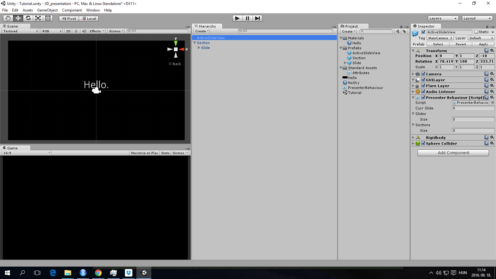
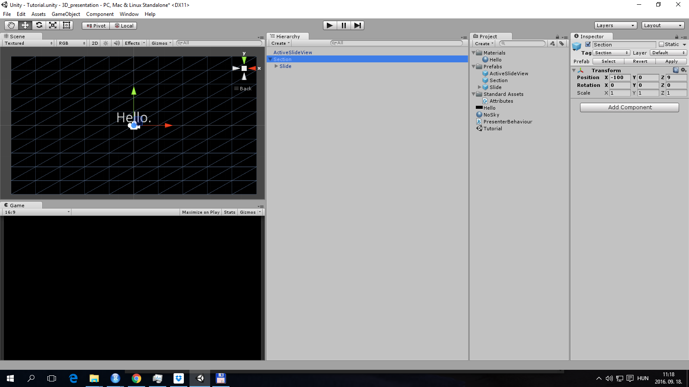
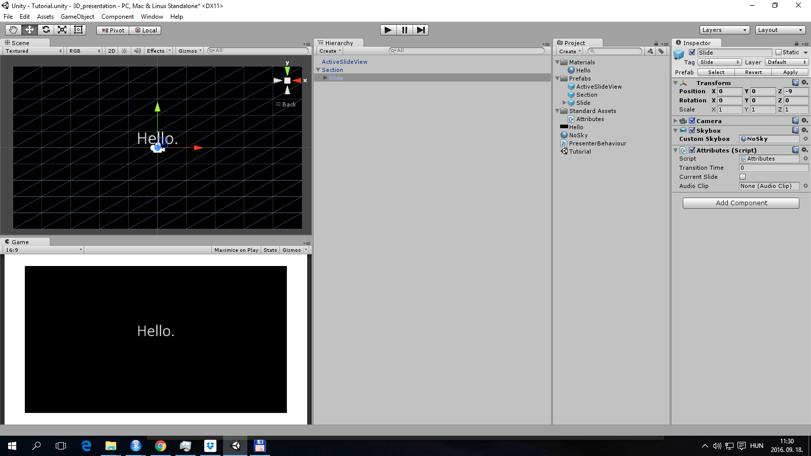

<h1 align="center"> Slides of loci </h1>
<h4 align="center"> A presentation tool for functional and effective 3D presentations </h4>

## Examples
[My presentation at the NLP meetup](http://agostontorok.github.io/research/nlp_meetup_synetiq_mediaresearch/)

## Motivation

There are already available some great tools for making impressive presentations. [Microsoft Powerpoint](https://products.office.com/en-US/powerpoint), [Apple Keynote](http://www.apple.com/keynote/), and [Prezi](https://prezi.com/) all have some superb features. However an effective and functional 3D presentation tool that is easy to use for everyone is lacking for a long time. In __Slides of loci__, that got it's name after _method of loci_, I aimed to provide a

- simple
- effective
- functional

toolkit to create 3D enabled presentations. Although, there is a temptation to move always in 3D with a 3D enabled software, [I found more evidence](http://agostontorok.github.io/research/torok_agoston_thesis.pdf) for the functionality of 2D navigation. I felt that the ideal presentation is 80 % Keynote style and 20 % Powerpoint slides, where the zoom-in and out functions of Prezi is used to convey hierarchical or temporal relations. Yet, there are cases when 3D change of place is essential. This tool was motivated one of these usecases: to _experiment_ with ways to present my doctoral thesis about VR experiments. Therefore, I aimed to create a flexible environment where I can mix 2D and 3D based on results of usability studies and my impressions, featuring:

1. Slide transitions are optional
2. The slides do not need to overlap for some transitions (unlike in Prezi)
3. Playing with the near and far clipping plane, objects can appear and disappear without changing the camera position
4. Sounds can be added to slides
5. Easy and intelligent editing of slideshow in [Unity3D](https://unity3d.com/)

## Tutorial

### Basic information

After installing [Unity3D](https://unity3d.com/) and [cloning my git repository](https://github.com/agostontorok/slides-of-loci.git) to your computer, open Slides of loci as a unity project. For easier editing I created a tutorial presentation, on which I explain here the basic functionality of Slides of loci. The horizontal field of view of the slides will be fixed to the angle that you would see with 16:9 aspect, therefore I suggest 16:9 aspect ratio for the Game view tab.

### Prefabs

First you, drag-n-drop the ActiveSlideView and a Section prefab from the prefab folder to the Scene hierarchy. All other objects in the hierarchy should be deleted. ActiveSlideView will be the eye of the presenter, this is a camera that travels between slides/scenes in the order you see __in the hierarchy__ this means that simply by changing the order of your slides __inside__ a section you change their order during presentation. You don't have to do anything with ActiveSlideView, just be sure you have it on your scene.

### Sections

Sections are helping you to handle a lot of slides when you don't want to bother with renaming them. Sections are read in __alphabetical order__ during presentation, therefore I suggest to rename them 1. First section's name, 2. Second section's name etc. when dealing with more sections. Sections are effective if, for example, you wnat to present information related to 2 places one after the other. Sections don't have scripts attached, they only bear the __"Section" tag__ as definitive feature.

### Slides

Slides are basically camera prespectives. They show what the ActiveSlideView will see once it reaches that slide. You can set the near and far clipping plane to modify the visibility of some objects. Playing with the clipping planes and the size of the object can help you create functional 3D scenes, that are [only visible from a certain angle](https://twistedsifter.files.wordpress.com/2012/05/shadow-kiss-meet-serendipity.jpg?w=600&h=382).

Slides have attributes that you can set for visiting them:

- You can assign a sound as AudioClip, that is going to played when you visit the slide.
- You can set the timing of the transition when visiting the slide (Note, for now timing and the size of the object/distance is related)
- You can add a custom skybox to the slide and so you can basically teleport the viewer
- You can switch the camera of the slide on/off during editing and can see what you will see during presentation

### Remarks

Slide of loci is still in experimental phase, this means it is open to change, development and new features. If you feel you can contribute, don't hesitate to create a Issue here or drop an email to me (info: [https://agostontorok.github.io](https://agostontorok.github.io)). 

IMPORTANT: GPL licence applies to the tool and not to your presentation, so I'm happy to know what you created, but you are free to use it for your private, internal presentations too.

Good luck!

Agoston

